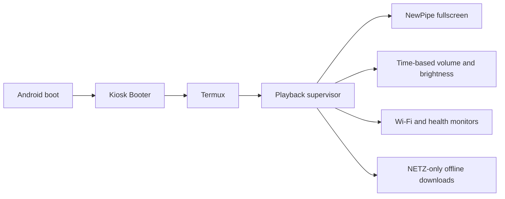

# Getting started

This guide is for someone who has just cloned the repository and wants to
understand the project before putting it on an Android tablet.

## What this project does

It turns an Android tablet into a supervised NewPipe kiosk:



The active behavior is:

| Area | What the user gets |
| --- | --- |
| Playback | NewPipe is kept in immersive fullscreen and recovers after sustained inactivity. |
| Content | Daytime playback is limited to the five configured subscription channels. |
| Schedule | Morning, learning, relaxing, bedtime, and night phases select the appropriate content and settings. |
| Sleep | Edubuzzkids is used at bedtime/night, with a configured Ms Rachel fallback. |
| Offline use | Permitted cached media can be handed to VLC when the network is unavailable. |
| Controls | A private parent PIN switches between parent access and child kiosk mode. |
| Reliability | Boot, Wi-Fi, playback, downloads, and services are monitored independently. |

This is a device deployment toolkit, not a standalone Android app or a hosted
service. It controls apps already installed on the tablet through ADB and
Termux.

## Before you start

You need:

- a Windows host with PowerShell 7, Git, Python 3, and Android platform tools;
- an Android tablet with NewPipe, Termux, Termux:API, Termux:Widget, and VLC
  installed from sources you trust;
- a data-capable USB cable;
- Android Developer Options and USB debugging enabled;
- the ignored deployment artifacts listed in
  [`BUILD-AND-ARTIFACTS.md`](BUILD-AND-ARTIFACTS.md).

The repository deliberately does not include `adb.exe`, APKs, JARs, cookies,
device serials, or runtime state. Build or restore those locally; never commit
them.

## First deployment

1. Clone the repository and open PowerShell in its directory.

   ```powershell
   git clone https://github.com/ZeroXSHDW/son-tablet-newpipe-kiosk.git
   cd son-tablet-newpipe-kiosk
   ```

2. Build or restore the ignored APK/JAR artifacts described in
   [`BUILD-AND-ARTIFACTS.md`](BUILD-AND-ARTIFACTS.md). Then run the read-only
   preflight; it gives a specific fix for every missing host tool or artifact:

   ```powershell
   .\CHECK-PREREQUISITES.ps1 -RequireArtifacts
   ```

   Confirm that `platform-tools\adb.exe` exists.

3. Connect the tablet by USB, unlock it, accept the **Allow USB debugging**
   prompt, and keep the screen on.

4. Run the guided deploy-and-health-check flow:

   ```powershell
   .\WAIT-AND-DEPLOY.ps1
   ```

   It waits for an authorized ADB device, deploys the source/configuration,
   switches to Wi-Fi ADB when possible, and runs a health check. If more than
   one device is connected, use the explicit serial form instead:

   ```powershell
   .\GET-DEVICE-SERIAL.ps1 -Wait -Copy
   .\DEPLOY-WIFI-ADB.ps1 -DeviceSerial <tablet-serial>
   .\HEALTH-CHECK.ps1 -DeviceSerial <tablet-serial>
   ```

   The serial helper labels USB and Wi-Fi ADB devices, explains
   `unauthorized`, and copies the only ready serial to the clipboard when
   possible.

5. On the tablet, allow the Kiosk Booter accessibility service if Android asks.
   Import `newpipe_subscriptions.json` into NewPipe and enable **Autoplay next
   stream**. The detailed NewPipe steps are in
   [`SUBSCRIPTIONS-SETUP.md`](SUBSCRIPTIONS-SETUP.md).

   To check only the ADB connection before deploying, run:

   ```powershell
   .\CHECK-PREREQUISITES.ps1 -CheckDevice
   ```

6. Set a private parent PIN when installing the Termux:Widget shortcut. This
   project intentionally ships no default PIN.

## What success looks like

After a successful deployment and reboot:

- the tablet starts the kiosk stack automatically;
- NewPipe opens in immersive fullscreen;
- playback uses only the configured channels;
- volume and brightness change at the configured phase boundaries;
- the parent toggle requires the private PIN;
- `HEALTH-CHECK.ps1` reports the active services and current phase.

To inspect a running tablet later:

```powershell
.\HEALTH-CHECK.ps1 -DeviceSerial <tablet-serial>
```

## Validate without a tablet

You can still validate a fresh checkout's source, scripts, policy, and
configuration before connecting hardware:

```powershell
pwsh -NoProfile -File .\tests\validate-repository.ps1
```

The same gate runs in GitHub Actions. It does not replace testing the actual
tablet after a cold reboot.

## Common issues

| Symptom | Fix |
| --- | --- |
| `unauthorized` in ADB output | Unlock the tablet and accept the USB debugging prompt. |
| More than one device is listed | Pass `-DeviceSerial <tablet-serial>` to deployment and health-check commands. |
| `adb not found` | Put `adb.exe` at `platform-tools\adb.exe`, or restore the ignored platform-tools directory. |
| Deployment asks for accessibility approval | Open Android Accessibility settings and enable Kiosk Booter, then rerun the health check. |
| Parent toggle refuses to run | Create a private `~/.kiosk_pin` through the setup script; no default credential is installed. |
| Playback is offline | Confirm Wi-Fi and NewPipe state first. VLC fallback only uses permitted cached media. |

For the control-plane details, read [`ACTIVE-STACK.md`](ACTIVE-STACK.md). For
the release and device verification gates, read
[`RELEASE-CHECKLIST.md`](RELEASE-CHECKLIST.md).
